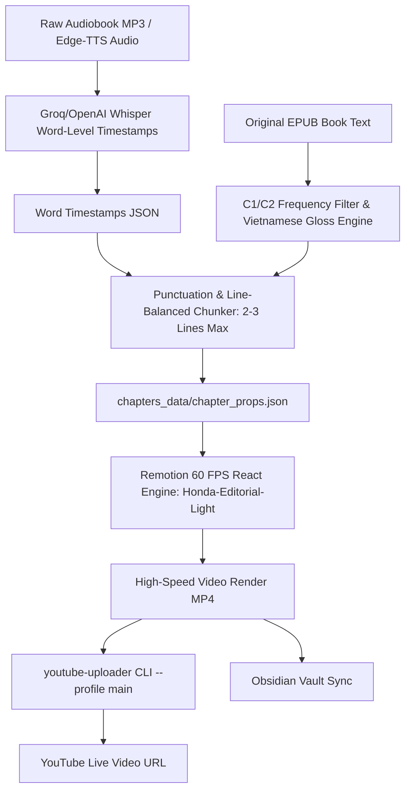

# 📖 Kinetic Audiobook & Editorial Video Production Pipeline

> An automated, high-precision kinetic typography production system for long-form audiobooks, educational essays, and storytelling videos built with **React**, **Remotion (60 FPS)**, **Groq/OpenAI Whisper**, and **Python**.

---

## ✨ Design Philosophy: The Calm Editorial Reader

Inspired by the documentary typography of *"The Practical Genius of Honda"*, this pipeline abandons distracting animations (bouncing words, pulsing glow, dark neon) in favor of **calm, readable, editorial typography with smart vocabulary glossing**:

- **Identical Font Metrics (Zero Glitter)**: Powered by *Google Literata* (`@remotion/google-fonts/Literata`) with preloaded `latin` and `vietnamese` subsets. All active and upcoming words share identical font weights and fixed baseline alignment with **zero pixel shift**.
- **Interlinear Top-Gloss Vocabulary System**: Difficult C1/C2 descriptive terms and rare vocabulary are automatically annotated with Vietnamese translations placed elegantly **directly above the English word** without parenthetical clutter.
- **Strict 2–3 Lines Per Slide**: Clean vertical distribution capped at maximum 3 lines per slide, perfectly paced to match the narrator's natural pauses.
- **Smart 2-Tier Personalized Filtering**: Uses `wordfreq` Zipf frequency scoring (`<= 4.15`) coupled with a personalized whitelist (`user_known_words.txt`) so familiar intermediate words are never translated.

---

## 🏗️ System Architecture



---

## 📂 Project Structure

```
.
├── src/
│   ├── EditorialPageReader.tsx     # Master Calm Editorial Reader with Interlinear Top-Gloss
│   ├── MinimalistKinetic.tsx       # Minimalist single-line & continuous ink engine
│   ├── SciFiAudioReactive.tsx      # Cyberpunk audio visualizer & telemetry HUD
│   ├── KineticTypography.tsx       # Universal dynamic kinetic card engine
│   ├── Root.tsx                    # Remotion composition registry
│   └── index.ts                    # Entrypoint
│
├── produce_full_chapter_1.py       # Full Chapter 1 end-to-end synthesizer (EPUB -> Audio -> Gloss -> Props)
├── auto_upload_when_done.py        # Automated YouTube uploader hook using youtube-uploader
├── user_known_words.txt            # Whitelist of personal known vocabulary (skipped from translation)
├── align_epub_chapters.py          # Fuzzy subsequence alignment against EPUB text
├── build_editorial_pages.py        # Sentence-aware chunker (2-3 lines max per page)
└── package.json                    # Remotion dependencies & scripts
```

---

## 🚀 Quick Start

### 1. Install Dependencies
```bash
npm install
pip install groq mutagen ebooklib beautifulsoup4 wordfreq deep-translator
```

### 2. Synthesize & Produce Chapter Props
Extract text from EPUB, synthesize narration, generate word timestamps, and format C1/C2 top-gloss:
```bash
python3 produce_full_chapter_1.py
```

### 3. Preview in Remotion Studio
```bash
npx remotion preview
```

### 4. Render 60 FPS Editorial Video
```bash
npx remotion render src/index.ts Honda-Editorial-Light out/brave_new_world_ch1_full_60fps.mp4 --props=chapters_data/brave_new_world_ch1_full_props.json --concurrency 8
```

### 5. Upload to YouTube via `youtube-uploader`
```bash
/Users/tamhn/.local/bin/youtube-uploader --profile main --json upload \
  --title "Brave New World - Chapter 1 (Full Audiobook & Interlinear Vocabulary Gloss)" \
  --description "Full Chapter 1 of Brave New World by Aldous Huxley with synchronized British narration and Vietnamese vocabulary gloss." \
  --tags "brave new world, audiobook, aldous huxley, kinetic text, english literature, learn english, tieng anh" \
  --privacy unlisted \
  --thumbnail out/full_ch1_p1.png \
  out/brave_new_world_ch1_full_60fps.mp4
```

---

## 📜 Standard Operating Procedures (SOP)
The complete operational guide is maintained in the Obsidian Vault at:
`Notes/SOP - Automated Kinetic Typography Audiobook Production & Publishing Pipeline.md`

---

## 📜 License
MIT License. Built for creators, authors, and language learners.
