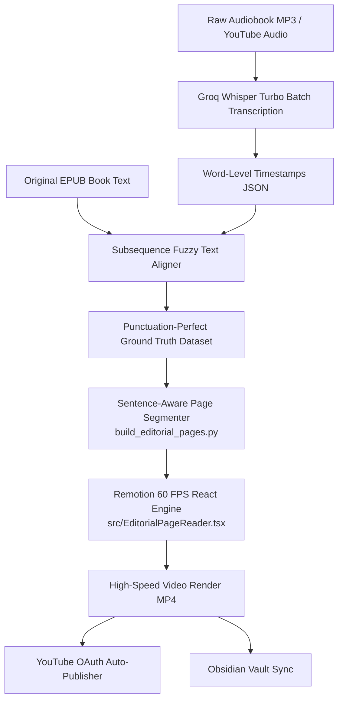

# 📖 Kinetic Audiobook & Editorial Video Production Pipeline

> An automated, high-precision kinetic typography production system for long-form audiobooks, educational essays, and storytelling videos built with **React**, **Remotion (60 FPS)**, **Groq Whisper**, and **Python**.

---

## ✨ Design Philosophy: The Calm Editorial Reader

Inspired by the documentary typography of *"The Practical Genius of Honda"*, this pipeline abandons distracting animations (bouncing words, pulsing glow, dark neon) in favor of **calm, readable, editorial typography**:

- **Identical Font Metrics (Zero Glitter)**: All active and upcoming words share the exact same font weight (`400`) and letter spacing. As narration progresses, characters smoothly switch from soft stone grey (`#b8b5ad`) to deep jet black (`#000000`) with **zero pixel shift**.
- **Multi-Line Paragraph Canvas**: Displays 3–5 generous lines of text (16–24 words per slide) on a warm alabaster paper background (`#faf9f6`), allowing the viewer's eye to read naturally ahead of the voice.
- **Instantaneous Sentence Cuts**: Page transitions occur instantly in the natural breathing pauses between sentences (0.25s after sentence completion), eliminating jarring opacity flickers and ghosting.
- **Literary Serif Typography**: Powered by *Newsreader* and *EB Garamond* with tight line heights (`1.2`) and large scale (`98px`).

---

## 🏗️ System Architecture



---

## 📂 Project Structure

```
.
├── src/
│   ├── EditorialPageReader.tsx     # Master Calm Editorial Reader (Honda style)
│   ├── MinimalistKinetic.tsx       # Minimalist single-line & continuous ink engine
│   ├── SciFiAudioReactive.tsx      # Cyberpunk audio visualizer & telemetry HUD
│   ├── KineticTypography.tsx       # Universal dynamic kinetic card engine
│   ├── KineticShowcase.tsx         # Style showcase (Viral Pop, Swiss, Parchment)
│   ├── Root.tsx                    # Remotion composition registry
│   └── index.ts                    # Entrypoint
│
├── build_editorial_pages.py        # Sentence-aware chunker (16-24 words per page)
├── align_epub_chapters.py          # Fuzzy subsequence alignment against EPUB text
├── groq_whisper.py                 # Fast parallel audio transcription
├── batch_render_and_publish_all.py # Full multi-chapter automated batch render
├── upload_all_to_youtube.py        # Headless YouTube metadata publisher
├── update_obsidian_master_note.py  # Vault sync & live chapter table updater
└── package.json                    # Remotion dependencies & scripts
```

---

## 🚀 Quick Start

### 1. Install Dependencies
```bash
npm install
pip install groq mutagen ebooklib beautifulsoup4 google-api-python-client
```

### 2. Generate Page Timings
Segment your audiobook chapter audio and word timestamps into balanced multi-line pages:
```bash
python3 build_editorial_pages.py
```

### 3. Preview in Remotion Studio
```bash
npx remotion preview
```

### 4. Render 60 FPS Editorial Video
```bash
npx remotion render src/index.ts Honda-Editorial-Light out/audiobook_chapter_60fps.mp4 --props=chapters_data/editorial_honda_props.json --concurrency 8
```

---

## ⚡ Multi-Node Remote Rendering

To offload heavy 60 FPS video rendering to an external server or Mac Mini cluster over Tailscale:

```bash
# Sync code and audio assets to remote machine
rsync -avz --exclude 'node_modules' --exclude 'out' ./ tambot@100.97.30.28:~/kinetic-text-video/

# Trigger high-speed headless render remotely
ssh tambot@100.97.30.28 "cd ~/kinetic-text-video && npx remotion render src/index.ts Honda-Editorial-Light out/chapter_render.mp4 --props=chapters_data/editorial_honda_props.json --concurrency 8"
```

---

## 📜 License
MIT License. Built for creators, authors, and educational storytellers.
